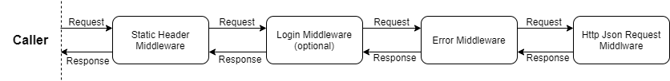

# Azuria — A Proxer.Me API in .NET (unofficial)

Azuria is a customizable and extensible C# API for the german anime and manga website [Proxer.Me](https://proxer.me/). It has been in development for quite some time now and was a breeding ground for different program designs when I was studying computer science. Therefore, this library is till in semi-development, but I do not expect the core design to change much going forward, and I would consider the current C# API to be “stable”. 

**Disclaimer:** Although the core design is stable, not every API action or class provided by the [Proxer.Me API](https://proxer.me/wiki/Proxer_API/v1) has been implemented. Furthermore, a lot of the classes and methods are undocumented, a short overview of the basic functionality of the library and its extensibility is provided below. The [official Proxer.Me API Wiki](https://proxer.me/wiki/Proxer_API/v1) (only available in German) should be used for any documentation about the API itself and about how to acquire a valid API key.

Master | NuGet | Coverage | Code Quality
------ | ----- | -------- | ------------
 | [](https://www.nuget.org/packages/Azuria) | [](https://codecov.io/gh/InfiniteSoul/Azuria) | [](https://www.codefactor.io/repository/github/infinitesoul/azuria)

---

# Installation

The library can be installed via NuGet either by running 

    Install-Package Azuria

or using the dotnet CLI

    dotnet add package Azuria

All Versions can be found on the [NuGet Page](https://www.nuget.org/packages/Azuria/).


# Using

General usage is centered around the `ProxerClient` class. This class keeps track of the request pipeline that is used for all API requests that go through this client. This request pipeline in turn keeps track of multiple factors, such as the logged in state of the client (see 'Authentication' below) and the used API key. Therefore, it is first necessary to create a new instance of the `ProxerClient` class to get started with the API:

```csharp
var client = ProxerClient.Create("api_key".ToCharArray());
```

The `Create` function also accepts an optional second parameter `optionsFactory` that can be used to modify the request pipeline and some further options of the client before the client is created.

```csharp
var client = ProxerClient.Create("api_key".ToCharArray(), options => ...);
```

For example the `optionsFactory` parameter could be used to add extra information to the user agent of the request.

```csharp
var client = ProxerClient.Create("api_key".ToCharArray(), options => options.WithExtraUserAgent("Your user agent extra"));
```

Further examples are explained in the Extensibility section below.

After successfully creating a `ProxerClient` instance, it now can be used to send requests to the API. The recommended way of doing this, is by using predefined request objects exposed by extensions methods. 

To create any request however, it is first necessary to use the `CreateRequest` extension method exposed by `Azuria.Requests.RequestExtensions`. After this is done, the extension methods found under `Azuria.Api.v1.ApiClassBuilderExtensions` can be used to create a request builder for a specific API class or a completely custom request (see 'Extensibility' below). For example the following code can be used to create a request builder for the `Info` API class that contains further pre-defined functions for making requests to the `Info` class.

```csharp
using Azuria.Api.v1;
using Azuria.Api.v1.RequestBuilder;

// Use pre-defined functions to create a request object
var requestBuilder = client.CreateRequest().FromInfoClass();
// Create a request object for the Info/Get Entry endpoint with an entry ID of 42
var request = requestBuilder.GetEntry(new SimpleIdInput(42));
```

It is also possible to create a custom request by using the `FromUrl` function defined by the `IApiRequestBuilder` instance returned by the `CreateRequest` extension method mentioned above. The below example creates a custom request that does not parse the resulting JSON response beyond checking for returned errors.

```csharp
// Create a request object from a custom API request
var request = client.CreateRequest()
                .FromUrl(new Uri("https://proxer.me/api/v1/api_class/example_fun"))
                // Define a GET parameter (inserted into the url as a query string)
                .WithGetParameter("get_key", "get_value")
                // Define a POST parameter (automatically changes request method to POST)
                .WithPostParameter("post_key", "post_value")
                // Define an additional header that is send with the request
                .WithHeader("header_key", "header_value");
```

In case it is necessary to parse the data JSON returned by the API, you can use the `WithResult<T>` function to define the type of the model to parse the JSON into. For example if we wanted to extend the above custom request to parse the returned data JSON into an instance of a class called `ApiData`, we could do it like this.

```csharp
var request = client.CreateRequest()
                .FromUrl(new Uri("https://proxer.me/api/v1/api_class/example_fun"))
                // Insert other options here
                ...
                .WithResult<ApiData>();
```

*Note:* By default [JSON.NET](https://www.newtonsoft.com/json) is used to parse the JSON response returned by the API. Therefore, it is recommended to refer to its documentation for information on how to create a model to parse the JSON into.

Irrespective of the method with which the request object was create, it can then be used to make the actual request to the API endpoint and optionally parse the returned JSON. To execute the request an extension method of `Azuria.Requests.RequestExtensions` is again used. The `DoRequestAsync` extension method then starts the request pipeline that is defined by the client that was used before to create the request. Beware that this extension method uses the `Task` API of .NET and therefore awaiting the returned `Task` is highly recommended in order to receive the result of the request.

```csharp
// Use a pre-defined function to create the request object
var requestBuilder = client.CreateRequest().FromInfoClass();
var request = requestBuilder.GetEntry(new SimpleIdInput(42));
// Execute the actual request
IProxerResult<EntryDataModel> proxerResult = await request.DoRequestAsync();
```

After awaiting the returned Task an instance of either the interface `IProxerResult` or `IProxerResult<T>` (when data is expected to be included in the response) is returned that can be used *1.* to check if the request was successful, *2.* to list exceptions that were thrown during execution of the request pipeline including returned errors by the API endpoint and *3.* to access the parsed data `T` of the response in case of `IProxerResult<T>`. In the case of the example above, we can access this information like the following.

```csharp
// Whether the request was successfull
bool success = proxerResult.Success;
// Exceptions thrown by the request pipeline and/or errors returned by the API endpoint
IEnumerable<Exception> exceptions = proxerResult.Exceptions;
// Parsed data field of the API response, only available if proxerResult is IProxerResult<T>
EntryDataModel data = proxerResult.Result;

// ...or use deconstructing to create a tuple of these values 
(bool success, IEnumerable<Exception> exceptions, EntryDataModel data) = proxerResult;
```

As you probably noticed already, the above function calls are designed to be easily chainable. For example, you could create and execute a request in one chain like this:

```csharp
// Create and execute a request from a pre-defined function
IProxerResult<EntryDataModel> result = await client.CreateRequest()
                                                .FromInfoClass()
                                                .GetEntry(new SimpleIdInput(42))
                                                .DoRequestAsync();

// Create and execute a custom request
IProxerResult result = await client.CreateRequest()
                                .FromUrl(new Uri("https://proxer.me/api/v1/api_class/example_fun"))
                                .WithGetParameter("get_key", "get_value")
                                .WithPostParameter("post_key", "post_value")
                                .WithHeader("header_key", "header_value")
                                .DoRequestAsync();

// Modify a pre-defined request with an extra request header and execute customized request
IProxerResult<EntryDataModel> result = await client.CreateRequest()
                                                .FromInfoClass()
                                                .GetEntry(new SimpleIdInput(42))
                                                .WithHeader("extra-header", "header_value")
                                                .DoRequestAsync();
```

# Authentication

The library can also be used to assist in the authentication process. In essence, besides remembering cookies set between request, the library can also be used to keep track of a login token. This login token can then be used to automatically log a user back in whenever the cookies expire during execution or when the application is started again.

To get started with authentication, just declare `WithAuthentication` in the options when creating a `ProxerClient` instance.

```csharp
// Use default authentication management without specifying a starting login token
var client = ProxerClient.Create("api_key".ToCharArray(), options => options.WithAuthentication());
// Use default authentication management WITH specifying a login token to begin with (i.e. after restarting the application)
var client = ProxerClient.Create("api_key".ToCharArray(), options => options.WithAuthentication("login_token".ToCharArray()));
```

In the case that no login token was given in the `WithAuthentication` call, this will then automatically listen for any requests for user authentication (i.e. calling the `User/Login` API endpoint) through the request pipeline of this client and remember the login token that the API responded with on success. **Note:** Automatically intercepting the login token only works if the data of the response is parsed as a `LoginDataModel` like it is the case when using the predefined login request. If you need to specify a custom data model for the request, you *have* to set the login token in the login manager using `SetLogin` in order to take advantage of the other functions of the login manager. If necessary, it is possible to get a reference to the first login manager found within the middleware pipeline by using the extension methods found in `Azuria.Authentication.AuthenticationExtensions`.

After creating the client, the request pipeline will now try to authenticate the client every time the request was specified with `WithLoginCheck` (regardless of custom or predefined request) like the following.

```csharp
// WithLoginCheck specified in custom request
var result = await client.CreateRequest()
                        .FromUrl(new Uri("https://proxer.me/api/v1/api_class/example_fun"))
                        // Signals the request pipeline to try to authenticate this request
                        .WithLoginCheck()
                        .DoRequestAsync();

// WithLoginCheck specified _within_ pre-defined request
var result = await client.CreateRequest()
                        .FromUcpClass()
                        .GetList(new UcpGetListInput {Limit = 2})
                        .DoRequestAsync();
```

In case of requests like these, by default (i.e. with the default login manager) every time the login manager suspects that the authentication cookies of the underlying HTTP client may be expired, it will insert the saved login token into the header of the send request. It will also insert the login token into the header if the API returned an 'unauthenticated' error. In this case the request pipeline will also be retried again with the new authentication header attached.

# Customization and Extensibility

The library uses an extensible middleware pipeline for each client that is used for all requests that are sent through the client. The pipeline is created at the same time as the client and therefore can be easily customized during creation of the client by passing an `optionFactory` to `ProxerClient.Create`.

As mentioned above, `ProxerClientOptions` exposes multiple convenience methods for common customizations. For example changing the timeout of the default HTTP client can be done like the following:

```csharp
// Set the timeout of the default HTTP client to 20 seconds (20,000 ms)
var client = ProxerClient.Create(new char[32], options => options.WithCustomHttpClient(20_000));
```

The middleware pipeline will then be automatically changed to accommodate the changed parameters. Beware that in some cases this will overwrite changes made to the pipeline beforehand. Read the documentation for the specific methods for more information.

It is also possible to completely overwrite certain instances of classes that are used within some middleware in the pipeline. For this to work though, it is first necessary do create a class that implements the necessary interfaces. For example, if we wanted to change the HTTP client that is used to communicate with the Proxer.Me API, we first need to create a class that implements the `Azuria.Requests.Http.IHttpClient` interface.

```csharp
public class CustomHttpClient : IHttpClient
{
    public Task<IProxerResult<string>> GetRequestAsync(Uri url, IDictionary<string, string> headers = null, CancellationToken token = default)
    {
        // Execute the GET request...
    }

    public Task<IProxerResult<string>> PostRequestAsync(Uri url, IEnumerable<KeyValuePair<string, string>> postArgs, IDictionary<string, string> headers = null, CancellationToken token = default)
    {
        // Execute the POST request...
    }
}
```

To insert our new custom HTTP client into the middleware pipeline during client creation, can then be easily accomplished like the following

```csharp
var client = ProxerClient.Create(new char[32], options => options.WithCustomHttpClient(new CustomHttpClient()));
```

Last but not least it is also possible to freely change the middleware pipeline itself. Either inserting, replacing or outright removing certain middlewares within the pipeline. For this to be possible certain functions are exposed by the pipeline that can assist in these operations. For example if we wanted to replace the `StaticHeaderMiddleware` within the pipeline with a new instance, the `IPipeline.ReplaceMiddleware` function can be used.

```csharp
options.Pipeline.ReplaceMiddleware(
    typeof(StaticHeaderMiddleware),
    new StaticHeaderMiddleware(new Dictionary<string, string>())
);
```

Beware that the usage of helper methods like `ProxerClientOptions.WithCustomHttpClient` may overwrite any manual changes done to the pipeline. It is advised to do any manual changes to the pipeline only after calling all necessary helper methods.

The default pipeline looks something like the following diagram. The request will begin on the left where it will traverse the middlewares in the order from left to right until it encounters the `Http Json Request Middleware`, where it will be executed. The returned and parsed response will then traverse the pipeline in reverse order from right to left until it leaves the pipeline again. At this point the response will be returned to the caller and the request will be done.



Keep in mind that any middleware can return an error anytime in which case the pipeline will short-circuit and immediately be traversed in reverse order until the error leaves the pipeline and is returned to the caller. I.e. if the `Error Middleware` returns an error while reading the request, the 'response' (the error) will then traverse the `Login Middleware` and the `Static Header Middleware` before it is returned to the caller.

It is also possible to create a custom middleware that can be inserted into pipeline by implementing the `Azuria.Middleware.IMiddleware` interface.

```csharp
public class CustomMiddleware : IMiddleware
{
    public async Task<IProxerResult> Invoke(IRequestBuilder request, MiddlewareAction next, 
        CancellationToken cancellationToken = default)
    {
        // TODO: Do something with the request...

        // Call the next middleware
        IProxerResult response = await next.Invoke(request, cancellationToken);

        // TODO: Do something with the response...

        // Return the response or anything else as long as it is an IProxerResult instance
        return response;
    }

    public async Task<IProxerResult<T>> InvokeWithResult<T>(IRequestBuilderWithResult<T> request, MiddlewareAction<T> next,
        CancellationToken cancellationToken = default)
    {
        // TODO: Do something with the request...

        // Call the next middleware
        IProxerResult<T> response = await next.Invoke(request, cancellationToken);

        // TODO: Do something with the response...

        // Return the response or anything else as long as it is an IProxerResult instance
        return response;
    }
}
```

Depending on whether the caller expects the returned data from the request to be parsed or not, either `InvokeWithResult<T>` or just `Invoke` will be called.

The general function of this middleware pipeline is similar to how the middleware pipeline of ASP .NET Core works. Therefore, the [middleware documentation](https://docs.microsoft.com/de-de/aspnet/core/fundamentals/middleware/?view=aspnetcore-5.0) of ASP .NET Core is advised for further reading.
